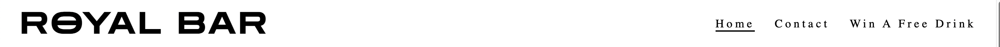
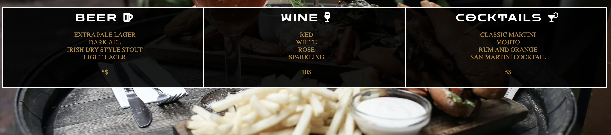
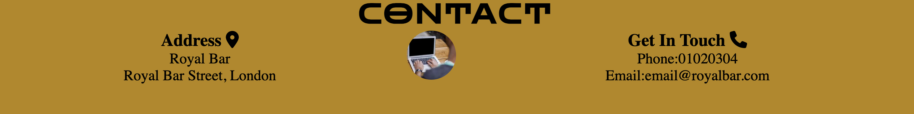
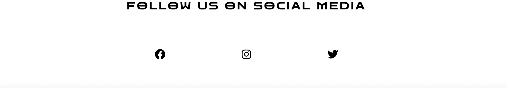

# Royal Bar #

This is a website for a London based bar. It helps us to show people not only what we offer but also where to find us. It is targeted to people 18+ who want to have a drink and socialise.

- - - -

## Features ##

### Navigation Bar ###

* At the top of the page the navigation bar shows the name of the bar
* The navigation bar also have three links to.. Home, Contact and Win a free drink
* This section will help the user navigate from page to page

#### The landing page ####
* The landing page includes a image of our bar with alcoholic drinks 
* This image introduces the user to what drinks we offer in our bar

#### Open times section ####
* This section shows two pictures and our open times. 
* For the user to easily find our open times 

#### Drinks menu #### 
* This section shows the user what drinks and price we offer
* This section also constantly updates to keep the users up to date with our menu 

#### Contact ####
* This section includes our address, phone number and email 
* This is for the user to easily contact us 

#### Footer #### 
* This section includes links for our users to find us on social media 
* When the links are clicked they open in a new tab for the user to visit 

#### Contact, navigation bar ####
* When contact is clicked in the navigation bar it redirects the user to the contact section 

#### Win a free drink #### 
* This sign up page will allow the user to win a free drink through signing up to our newsletter 
* The user needs to fill in first-name, last-name and email-address. 

## Testing ##

* I have tested the browser on different browsers, safari, firefox and chrome  
* I have tested the "signup-form", requiers entries in every field and only accepts email in email field 
* I confirmed that the site looks responsive on different devices
* The footer section provides three links to social media pages, and when clicked, they open in a new tab. 
* The navigation bar has three options, "Home" "Contact" and "Win a free drink" 
* When home is clicked it refreshes the page and sends the user to the top of the home page  
* When contact is clicked it redirects the user to the contact section at the bottom of the home page 
* When "Win a freee drink" is clicked it sends the user to a new page where they can sign up  
* The navigation bar is tested and works as intended 
* The site is easy to read and navigate thorugh  

## Validator testing ##
* Html 
   * No errors or warnings found when running the index.html code, [W3C validator](https://validator.w3.org/#validate_by_input
   * no errors or warnings found when running the signup.html code, [W3C validator](https://validator.w3.org/#validate_by_input
* Css
   * No errors or warnings found when running the css code, [W3C validator](https://jigsaw.w3.org/css-validator/validator.html.en#validate_by_input

## Deployment ##

* The site was deployed to Github pages the steps are as follow:
  * In the github repository, navigate to the settings tab 
  * Select main branch from the source drop down menu  
  * Once the main branch has been selected and saved the page will automatically get deployed and a display with the link will be at the top of the page 

  You can access the site from this link: https://8000-dominikwigh-portfolio1-68l2axyuaf9.ws-eu77.gitpod.io/index.html

## Credits ##
* My mentor Rory Patrick. For all guidance and help. 
### Content ###
 * The code for "header" and "open times section" was taken from the Love running project and adjusted 
 * Icons on the site were taken from [Font awesome](https://fontawesome.com/
 * The fonts were taken from [Google fonts](https://fonts.google.com/
 * The code for the "signup form" was taken from the Love running project and adjusted
 * the code for the "contact section" was taken from [W3schools](https://www.w3schools.com/default.asp
 * The codes for media queries were taken from [W3schools](https://www.w3schools.com/default.asp
 
### Media ### 
 * Images were taken from [Pexels](https://www.pexels.com/
 * The image in the contact section was taken from [Picsum](https://picsum.photos/
 * All screenshots in this README were taken by myself

